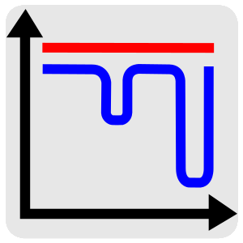

*************************
Overview
*************************

The Free Energy and Advanced Sampling Simulation Toolkit (FEASST) is a free and open-source software to conduct molecular- and particle-based simulations with Monte Carlo methods.
New users can start with the `website <https://pages.nist.gov/feasst/>`_ (`DOI <https://doi.org/10.18434/M3S095>`_), `manuscript <https://doi.org/10.1063/5.0224283>`_, `GitHub discussion <https://github.com/usnistgov/feasst/discussions>`_ and a `five minute video <https://www.nist.gov/video/how-use-feasst-0255-monte-carlo-molecular-simulation-software>`_.
Support FEASST with a `GitHub <https://github.com/usnistgov/feasst>`_ star or `manuscript <https://doi.org/10.1063/5.0224283>`_ citation!

Features in version 0.25.19
================================================================================

The :doc:`/plugin/text_interface` includes:

Monte Carlo simulation techniques

* `Metropolis <tutorial/tutorial.html>`_ and `Mayer-sampling <plugin/mayer/README.html>`_
* `Flat Histogram <plugin/flat_histogram/README.html>`_ Wang-Landau and transition-matrix

Thermodynamic ensembles

* `Microcanonical <plugin/flat_histogram/doc/MacrostateEnergy_arguments.html>`_, `canonical <tutorial/tutorial.html>`_, (`semi <plugin/morph/README.html>`_-) `grand canonical <plugin/flat_histogram/tutorial/tutorial_01_lj_gcmc.html>`_
* `Isothermal-isobaric <plugin/monte_carlo/tutorial/tutorial_1_lj_npt.html>`_, `Gibbs <plugin/gibbs/README.html>`_ and `temperature <plugin/beta_expanded/README.html>`_ expanded

Interaction potentials

* `Lennard-Jones <tutorial/tutorial.html>`_ and `Mie <plugin/flat_histogram/tutorial/tutorial_14_binary.html>`_ with `cut/force shift <plugin/models/doc/LennardJonesCutShift_arguments.html>`_ and `corrections <plugin/system/doc/LongRangeCorrections_arguments.html>`_, `hard sphere <plugin/flat_histogram/tutorial/tutorial_07_hs_tm_parallel.html>`_ and `square well <plugin/models/doc/SquareWell_arguments.html>`_
* `Ewald <plugin/charge/tutorial/tutorial_1_spce_nvt.html>`_ summation, 2D `slab correction <plugin/charge/doc/SlabCorrection_arguments.html>`_, `Yukawa <plugin/models/doc/Yukawa_arguments.html>`_, `Coulomb <plugin/charge/doc/Coulomb_arguments.html>`_ and `custom tabulated interactions <plugin/models/tutorial/tutorial_1_lj_table.html>`_
* `Cell list <plugin/monte_carlo/tutorial/tutorial_4_lj_triclinic_celllist.html>`_, `neighbor list <plugin/flat_histogram/tutorial/tutorial_08_trimer_tm_parallel.html>`_, `bonds, angles and dihedrals <particle/README.html#bond-angle-and-dihedral-properties>`_, `TraPPE small molecules and alkanes <plugin/flat_histogram/tutorial/tutorial_11_trappe_alkane.html>`_
* `Kern-Frenkel patches <plugin/flat_histogram/tutorial/tutorial_09_kf_tm_parallel.html>`_, `Spherocylinders <plugin/patch/tutorial/tutorial_1_spherocylinders.html>`_ and `precomputed anisotropic particles <plugin/aniso/README.html>`_
* Confinement with `fixed sites <plugin/confinement/tutorial/tutorial_2_co2_zif8.html>`_, `slabs <plugin/shape/doc/Slab_arguments.html>`_, `sine waves <plugin/shape/doc/SlabSine_arguments.html>`_, `cylinders <plugin/shape/doc/Cylinder_arguments.html>`_, `spheres <plugin/shape/doc/Sphere_arguments.html>`_, `ellipsoids and supertoroids <plugin/shape/doc/Supertoroid_arguments.html>`_

Monte Carlo trials

* `Translation <plugin/monte_carlo/doc/TrialTranslate_arguments.html>`_, `rotation <plugin/chain/doc/TrialParticlePivot_arguments.html>`_, `crankshaft <plugin/chain/doc/TrialCrankshaft_arguments.html>`_, `pivot <plugin/chain/doc/TrialPivot_arguments.html>`_, `rigid cluster rotation and translation <plugin/cluster/doc/TrialRigidCluster_arguments.html>`_
* `Configurational bias transfers, partial regrowth, reptation and Jacobian-Gaussian branches <plugin/chain/doc/TrialGrow_arguments.html>`_
* `Dual-cut configurational bias <plugin/monte_carlo/doc/TrialStage_arguments.html>`_, `aggregation volume bias <plugin/cluster/doc/TrialAVB2_arguments.html>`_

Convenient usage

* Interface as `text input <tutorial/tutorial.html>`_, `C++ library <plugin/README.html>`_, `Python module <python/README.html>`_ and `client-server C++ or Python <plugin/server/README.rst>`_
* `OpenMP parallelization <plugin/flat_histogram/doc/CollectionMatrixSplice_arguments.html>`_ and `prefetching <plugin/prefetch/README.html>`_, and save and restart with `checkpoint <plugin/utils/doc/Checkpoint_arguments.html>`_ files

Quickstart
===========

.. code-block:: bash

    sudo apt install g++ cmake python3-venv               # C++, CMake and Python3
    python3 -m venv feasst; source ~/feasst/bin/activate  # or use existing env/conda
    CMAKE_BUILD_PARALLEL_LEVEL=8 pip3 install feasst      # install
    feasst-menu                                           # interactive tutorial

For Mac/Linux use apt, yum, dnf, brew(homebrew), etc.
For Windows, use WSL.
For HPC, use "module avail/load."

C++ Executable
=============================

Run with BASH/etc:

.. code-block:: bash

    #!/bin/bash
    num_particles=500
    density=0.003
    beta=`python3 -c "print(1./0.9)"`
    length=`python3 -c "print(($num_particles/$density)**(1./3.))"`
    tpc=1e4
    feasst << EOF
    # Comments begin with the # symbol.
    # Compute average energy of LJ at T*=0.9, rho*=0.003
    # See https://mmlapps.nist.gov/srs/LJ_PURE/mc.htm
    MonteCarlo
    RandomMT19937
    #seed=1572362164
    Configuration cubic_side_length=$length particle_type=lj:/feasst/particle/lj.txt
    Potential Model=LennardJones VisitModel=VisitModelCell
    Potential VisitModel=LongRangeCorrections
    Checkpoint checkpoint_file=checkpoint.fst
    ThermoParams beta=$beta chemical_potential=-1
    Metropolis
    TrialTranslate weight=1 tunable_param=2
    Tune
    CheckEnergy trials_per_update=$tpc decimal_places=8
    Log trials_per_write=$tpc output_file=lj_eq.csv
    Run until_num_particles=$num_particles particle_type=lj Trial=TrialAdd weight=2
    Run num_trials=1e5
    Remove name=Tune,Log
    WriteCheckpoint
    EOF
    
Restart with checkpoint.fst and BASH/etc:

.. code-block:: bash

    #!/bin/bash
    write="trials_per_write=1e4 output_file=lj"
    feasst << EOF
    Restart checkpoint_file=checkpoint.fst
    Log $write.csv
    Movie $write.xyz
    Energy ${write}_en.csv
    Metropolis trials_per_cycle=1e4 cycles_to_complete=1e2
    Run until=complete
    EOF
    
Run with script.txt and BASH/etc:

.. code-block:: bash

    feasst < script.txt

Python Module
=======================

Install with BASH/etc:

.. code-block:: bash

    sudo apt install g++ cmake python3-dev python3-venv
    python3 -m venv feasst; source ~/feasst/bin/activate
    CMAKE_BUILD_PARALLEL_LEVEL=8 CMAKE_ARGS="-DUSE_PYBIND11=ON" pip install feasst

Run in Python:

.. code-block:: python

    import numpy as np
    import pandas as pd
    import feasst
    
    # Compare with T*=0.9,rho*=0.003 in https://mmlapps.nist.gov/srs/LJ_PURE/mc.htm.
    num_particles=500
    density=0.003
    beta=1./0.9
    length=np.power(num_particles/density, 1./3.)
    prefix='lj'
    write=f'trials_per_write=1e4 output_file={prefix}'
    
    mc = feasst.MonteCarlo()
    feasst.parse(mc, f"""RandomMT19937 seed=416974832
    Configuration cubic_side_length={length} particle_type=lj:/feasst/particle/lj_new.txt
    Potential Model=LennardJones VisitModel=VisitModelCell
    ThermoParams beta={beta} chemical_potential=1
    Metropolis
    TrialTranslate tunable_param=2
    Checkpoint checkpoint_file={prefix}_checkpoint.fst num_hours=1 num_hours_terminate=117.5667
    CheckEnergy trials_per_update=1e4 decimal_places=8
    Log {write}_eq.csv
    Movie {write}_eq.xyz
    Run until_num_particles={num_particles} Trial=TrialAdd particle_type=lj
    Metropolis trials_per_cycle=1e4 cycles_to_complete=10
    Run until=complete Stepper=Tune
    Remove name=Log,Movie""")
    
    print('# x-position of first particle/site.', mc.configuration(0).particle(0).site(0).position(0))
    assert mc.configuration(0).particle(0).site(0).position(0) != 0.
    
    feasst.parse(mc, f"""Metropolis trials_per_cycle=1e4 cycles_to_complete=1e2
    Log {write}.csv
    Movie {write}.xyz
    Energy {write}_en.csv
    CPUTime {write}_cpu.csv
    ProfileCPU {write}_profile.csv
    GhostTrialVolume {write}_pressure.csv trials_per_update=1e4
    Run until=complete""")
    
    print('# compare average energy with SRSW https://mmlapps.nist.gov/srs/LJ_PURE/mc.htm.')
    en = pd.read_csv('lj_en.csv')
    print('<U> =', en['average'][0]/num_particles, '+/-', en['block_stdev'][0]/num_particles)
    
C++ Library or Development
===============================================

FEASST requires C++14 and `CMake <https://cmake.org/>`_, and is compiled with the following Bash commands:

.. code-block:: bash

    # [apt/yum/dnf/brew] install g++ cmake curl tar. On HPC, try "module avail/load"
    cd $HOME # replace this with your preference throughout
    curl -OL https://github.com/usnistgov/feasst/archive/refs/tags/v0.25.19.tar.gz # download
    tar -xf v0.25.19.tar.gz           # uncompress
    mkdir feasst-0.25.19/build; cd $_ # out-of-source build
    cmake -DUSE_PIP=OFF ..            # find prerequisites
    make install -j 4                 # compile on 4 threads
    # Optional Python packages used in tutorials. Virtual environment recommended:
    # https://packaging.python.org/en/latest/guides/installing-using-pip-and-virtual-environments
    pip install jupyter matplotlib pandas scipy ..
    # Because online documentation changes with verison, open local version documentation.
    open ../html/index.html

Input a text file to the compiled executable.

.. code-block:: bash

    $HOME/feasst-0.25.19/build/bin/fst < $HOME/feasst-0.25.19/tutorial/example.txt

How to learn more
===============================================

* Use the "feasst-menu" command.
* Review the :doc:`first <tutorial/tutorial>` and :doc:`second tutorial<tutorial/launch>`.

  * Copy/paste or use the URL to find the code (e.g., https://pages.nist.gov/feasst/tutorial/launch.html is ``$HOME/feasst/tutorial/launch.py``).
  * See ``python launch.py --help`` (e.g., adjust ``--feasst_install`` or ``--hours_terminate``).
* Find :doc:`tutorial/README` that are closest to what you would like to accomplish.
* Reproduce the expected result of those :doc:`tutorial/README`.
* To modify :doc:`tutorial/README` to accomplish your goals, refer to the :doc:`../plugin/text_interface` documentation.
* Compare the energy of a :doc:`reference configuration<plugin/monte_carlo/tutorial/tutorial_0_ref_configs>` with a trusted source to ensure the model, :doc:`/particle/README` return an expected result.
* :doc:`/CONTACT` us.

Troubleshooting install
================================================================================

Please :doc:`/CONTACT` us if you run into an issue not listed below.

Ubuntu 18, 20, 22, 24 and Rocky 8 and 9
~~~~~~~~~~~~~~~~~~~~~~~~~~~~~~~~~~~~~~~~

* We are not aware of any install issues with these OS.

Ubuntu 16
~~~~~~~~~~

* Update to CMake 3 (https://cmake.org/download/)

CentOS 7
~~~~~~~~~

CMake version is usually too old.
Try the command cmake3 instead of cmake.

Cray (NERSC CORI)
~~~~~~~~~~~~~~~~~~

* OpenMP functions may not work unless the cray programming environment is disabled.

macOS Mojave
~~~~~~~~~~~~~~~~~~~~~~~~~~~~~~~~~

* for omp, try brew install libomp

Windows 10
~~~~~~~~~~~

* Install Windows subsystem for Linux (Ubuntu 16)
* See Ubuntu 16

.. include:: CONTACT.rst

.. include:: DISCLAIMER.rst

.. include:: LICENSE.rst
