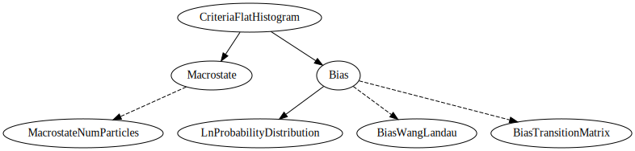

***************
Flat histogram
***************

Flat histogram Monte Carlo methods bias the system along a macrostate, or order parameter, to observe uniform sampling and recover the free energy as a function of this order parameter.

:cpp:class:`CriteriaFlatHistogram <feasst::CriteriaFlatHistogram>` contains a :cpp:class:`Macrostate <feasst::Macrostate>` and a :cpp:class:`Bias <feasst::Bias>`.
The :cpp:class:`Macrostate <feasst::Macrostate>` could be the :cpp:class:`number of particles <feasst::MacrostateNumParticles>` or some other quantity such as the energy of a parameter of the model.
The method of :cpp:class:`Bias <feasst::Bias>` includes :cpp:class:`Wang-Landau <feasst::BiasWangLandau>` and :cpp:class:`Transition-Matrix <feasst::BiasTransitionMatrix>`.
Importantly, the :cpp:class:`Bias <feasst::Bias>` computes the :cpp:class:`probability distribution of the macrostate <feasst::LnProbabilityDistribution>` on the fly, which is related to the free energy.

Tutorial
=========

.. toctree::

   tutorial/README

FEASST plugin dependencies
============================

* :doc:`../monte_carlo/README`

API
===

.. toctree::

   doc/toc

