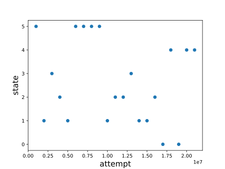
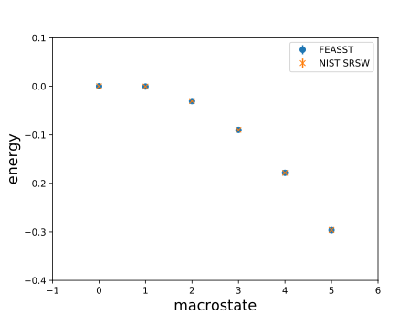
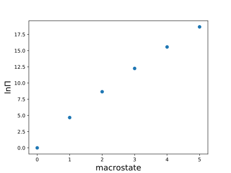

Files
=====

A series of files in `plugin/flat_histogram/tutorial/` include:

* `fh.py` and `lj_fh.py`: utility modules to simplify creation of flat histogram criteria and Monte Carlo simulations.

* `test_1_lj_gcmc.py`: conduct grand canonical ensemble flat histogram Monte Carlo simulation of LJ and compare the free energy and potential energy with published results.

Grand canonical ensemble transition-matrix Monte Carlo
============================================================

.. sidebar:: Testing tips

   A small macrostate range allows the simulation to run quickly with good sampling, and thus it is an ideal starting point to test the simulations.

In this example, flat histogram methods are employed for a small macrostate range from 0 to 5 particles.
Flat histogram acceptance criteria are defined using `fh.py`.
The Monte Carlo simulation is in `lj_fh.py`.
To begin, the system is initialized with the minimum number of particles by setting Metropolis acceptance criteria with favorable conditions for adding particles.
The Metropolis criteria are then replaced with the flat histogram criteria.
At this point, typical analysis from the previous tutorials are added.
In addition, we also add checkpoint files, criteria status, and average energy of a given macrostate.
Finally, the simulation is run until the requested number of iterations of the flat histogram algorithm are complete.

Run the simulation on the command line and you should see output like the following::

   [user@host]$ feasst/py/run.sh feasst/plugin/flat_histogram/tutorial/test_1_lj_gcmc.py
   ...
   .
   ----------------------------------------------------------------------
   Ran 1 test in 70.702s

   OK

A number of files should also have been created.
For example, a plot of the log file using `python plot_log.py` may look something like this:

.. sidebar:: Sampling

   If the flat histogram method is sampling perfectly, the simulation performs a random walk along the macrostate.
   For larger ranges of macrostates, or for more difficult sampling cases, monitoring the macrostate can help you determine what conditions are preventing covergence.

The energy of each macrostate may be visualized and compared with the published values in the NIST SRSW using `python plot_energy.py` which may look like this:

.. sidebar:: Checkpointing

   Note that the `plot_energy.py` script makes use of the checkpoint file to obtain useful information such as the number of macrostates.

You may also plot the natural logarithm of the macrostate probability using `python plot_crit.py` which may look like this:

.. sidebar:: Histogram reweighting

   The macrostate probability distribution depends upon the choice of the chemical potential, but can be reweighted to different chemical potentials.

Ensemble averages
----------------------------------------------

For a macrostate of the number of particles, :math:`N`, the canonical ensemble averages from the flat histogram simulations are computed as follows:

.. math::

   \langle A(N) \rangle_{NVT} = \frac{\sum_{i=0}^{N_{trial}} A(i) \delta(n_i - N)}{\sum_{i=0}^{N_{trial}} \delta(n_i - N)}

Instead of only utilizing the canonical ensemble averages at each value of the macrostate, one should instead compute a grand canonical ensemble average using the macrostate probability distribution and all of the canonical ensemble averages in the range :math:`N \epsilon (N_{min}, N_{max})`.
In the example above, :math:`N_{max}=5`.
Thus, grand canonical ensemble averages are defined as:

.. math::

   \langle A(\langle N\rangle_{\mu VT}) \rangle_{\mu VT} = \sum_{n=N_{min}}^{N_{max}}\langle A(n) \rangle_{NVT}\Pi(n; \mu)

.. sidebar:: :math:`N_{min}` and :math:`N_{max}`

   :math:`N_{min} = 0` is a natural choice if feasible.
   These bounds, especially :math:`N_{max}`, should be chosen such that :math:`\Pi` is vanishingly small and therefore the canonical ensemble average does not contribute to the grand canonical ensemble average.

Where

.. math::

   \langle N\rangle_{\mu VT} = \sum_{n=N_{min}}^{N_{max}} n\Pi(n; \mu)

Now that the grand canonical ensemble averages are computed for the particular value of the chemical potential, :math:`\mu`, the macrostate distribution can be reweighted to different chemical potentials, :math:`\mu'`.
Thus, with a continuous variation in :math:`\mu'` one can also obtain a continuous variation in the grand canonical ensemble averages, within the limits of :math:`N_{min}, N_{max}`.

Histogram reweighting
----------------------

Analysis of flat histogram simulations is greatly enhanced by the use of histogram reweighting, which allows you to obtain information continuously as a function of the macrostate's thermodynamic conjugate.
Thus, for the grand canonical ensemble with the number of particles as the macrostate, :math:`N`, we can reweight to various values of chemical potential, :math:`\mu`.
For microcanonical partition function, :math:`\Omega(N,V,U)`, canonical, :math:`Q(N,V,T)` and grand canonical, :math:`\Xi(\mu, V, T)`, the probability to observe a state, :math:`\Pi` is given by

.. math::
   :nowrap:

   \begin{gather*}
   \ln\Pi'(N,U; \mu', V, \beta) + \beta U - \beta \mu N = \ln\Omega(N,U,V) - \ln\Xi(\mu,V,T) \\
   \ln\Pi'(N; \mu', V, \beta) = \ln\Pi(N; \mu, V, \beta) + N\beta(\mu` - \mu) + Const \\
   \end{gather*}

For histogram reweighting, apply the last equation above to the macrostate probability distribution, :math:`ln\Pi`, and renormalize, :math:`\sum \Pi = 1`.
When there are multiple peaks in :math:`ln\Pi` that do not change greatly with system size, this often corresponds to different macroscopic phases.

.. include:: /dev/sphinx/feedback.rst

